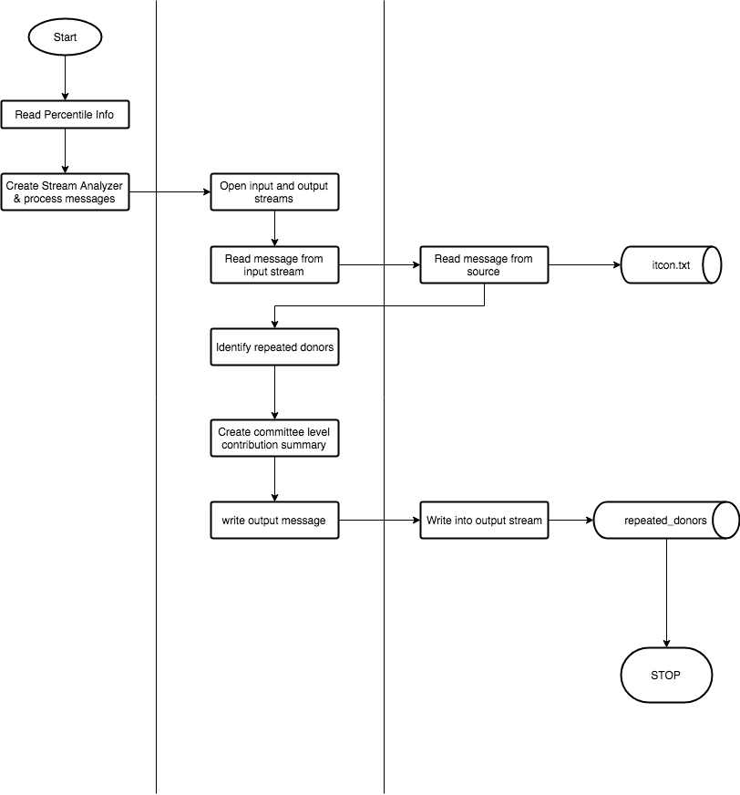

# Analytics on Streaming data - Donation contributions by individuals.

This is an analytics project that provides feedback on repeated campaign contributions from a given area (or zip-code) in the United States.

## Business Aspect
The results of this analytics aims to answer the following not-so-exhaustive-yet-important business aspects.

1. Identify areas with large number repeated donors
1. Correlate with the money spent in these areas
1. Allow better utilization of resources in terms of money and man
1. Targetted campaigning

## Overview

The data about each and every donation is considered to be streaming in and very limited amount of storage is available. This considers the committee and the area to which an individual has made a donation. Without storing any individual's information, a summary of the area is calculated from time to time and emitted as output.

The program currently reads from a file but the design has been made to be to abstract a stream reader. The input and output modules can be easily replaced with a streaming service like Kafka or Storm.

Information on how to run this is provided [here](README.md#running-the-code)

More informaiton about this analytics module has been provided [here](https://github.com/InsightDataScience/donation-analytics/).

## Details about implementation & handling corner cases

### Calculating repeated donors

Repeated donors are any individual who has donated to a committee in the same area over years. Since the data is not streaming in chronological order, it is important to know if the order in which we see donations actually constitutes repetition.

To tackle this problem, we can just store the `earliest donation record` that a `Donor` has made that has been streamed in at any given time `t`. We consider any `Donor` who has donated after the mentioned `earliest donation record` will be a repeated donor. At any time `t + k` if we find a donation prior to `earliest donation record` we simply update this without considering the donation as repeated one.

#### Handling same year donations by same Donor

On looking at the data, we can see that a `Donor` can make more than one donation or the committee can add an amendment. We consider both cases as individual contributions which the `Donor` has done separately.

In some cases, the second transaction by a `Donor` in the same year will determine the `Donor` as repeated Donor. The intricate detail is handled by considering all donations by a `Donor` yearly and adding all the donations of newly identified donors to the committee's contribution list. This is handled in `addAmount(double amount, Donor donor, int year)` function in `CommitteeDetails`.

### Calculating percentile

The `CommitteeDetails` class will maintian all donations received from repeated donors for a given `CommitteeId`, `Zipcode`, `Year`. The percentile is calculated using nearest rank method.

## Design of classes

Data structure commonly used are `HashMap` and `HashSet`. Since custom class objects are modeled as keys, the `hashCode()` and `equals()` method are overridden accordingly.

The design of classes can be split into 4 sections (as they are packaged).
### Analytics platform
This contains 2 classes which provide the complete functionality of the analytics module.
1. `DonationAnalytics` - This is the main class. Basic input handling and wiring of functions happen here
1. `StreamAnalyzer` - Calls relevant helper methods from other classes to handle the entire business logic

### Stream abstraction
The abstraction of stream is provided by the `StreamReader` and `StreamWriter` interfaces. Both these have method signatures to do basic stream operations like `read`, `write` and `close`.

`FileStreamReader` and `FileStreamWriter` implements the interfaces and wraps the logic of creating file stream processing.

### Models

Separate models for input and output messages are created. They are serialize and deserialize the data from the stream and using with other models used in `StreamAnalyzer` are created.

`Donor` and `Committee` form the core models for donation and reception of money in this system. They are indexed based on following requirements.

1. `Donor` - indexed using `name`, `zipcode`.
1. `Committee` - indexed using `committeeId`, `zipcode`, `year`.

`CommitteeDetails` store info about each `Committee` and calculates percentile.

### Miscellaneous classes

The exception class `DonationAnalyticsException` is used to wrap and handle exceptions, provided meaningful messages and safely exit the program during an exception.

## Scalability

This code has been tested with large datasets upto 1.3 GB (7 million records). Total time taken is **57 sec**. The main bottleneck is the calculation of required percentile for each `Committee`.

More test cases are provided in `insight_testsuite/tests`.

## Running the code

This code can be run using the following command.

```
java -jar final.jar [app.properties]
```

The `app.properties` will contain `percentileFile`, `inputFile` and `outputFile` as three properties with relevant values. Sample properties file has been provided along with this. This provides a flexibility to provide input from a different folder. IGNORE this if you are having `input` and `output` folder.

The properties file is optional. If not set, it will pick the input from `input/percentile.txt`, `input/itcont.txt` and `output/repeat_donors.txt`. The folders `input` and `output` are expected to be in the same directory as the jar `final.jar`.

The `run_tests.sh` has been run and the results were successful. Expected folder structure to run the code adhoc.

```
├── final.jar
├── [optional app.properties]
├── input
│   └── percentile.txt
│   └── itcont.txt
├── output
|   └── repeat_donors.txt
```

## Flow diagram



-- Note: that `eclipse-project` folder is not any part of submission. It can be ignored.
